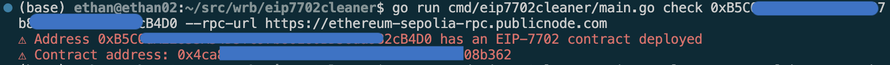
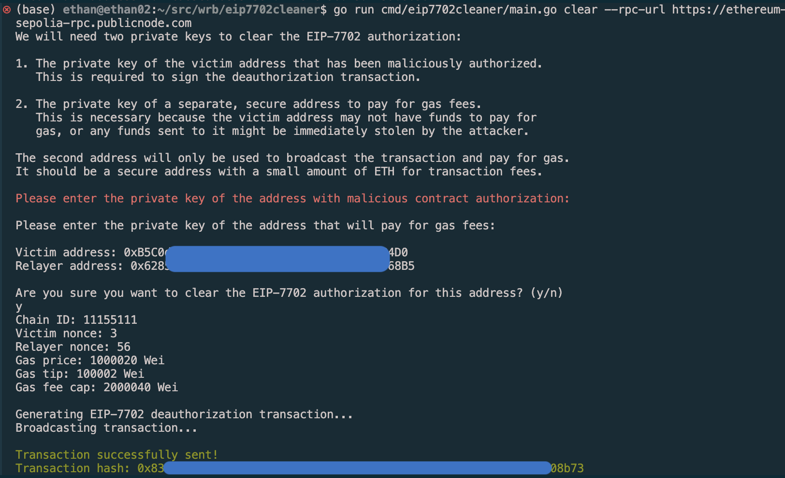

# EIP-7702 Cleaner

A command-line tool for checking and cleaning EIP-7702 contracts on Ethereum addresses.


<a href="https://x.com/intent/follow?screen_name=0x99_Ethan">

</a>

## Installation

### Using Go Install

```bash
go install github.com/ethanzhrepo/eip7702cleaner/cmd/eip7702cleaner@latest
```

### Building from Source

Clone the repository and build:

```bash
git clone https://github.com/ethanzhrepo/eip7702cleaner.git
cd eip7702cleaner
go build -o eip7702cleaner ./cmd/eip7702cleaner
```

### Pre-built Binaries

Download the pre-built binaries for your platform from the [Releases](https://github.com/ethanzhrepo/eip7702cleaner/releases) page.

## Usage

```bash
eip7702cleaner [command] [options]
```

### Commands

#### Check if an address has an EIP-7702 contract

```bash
eip7702cleaner check <address> [--rpc-url <url>] [--debug]
```

This command checks if an Ethereum address has an EIP-7702 contract deployed:
- If the address has no code, it's considered safe (green output)
- If the address has code starting with 0xef0100, it warns about an EIP-7702 contract and displays the contract address (red output)
- If the address has other code, it warns that the address might be a contract (yellow output)

The `--debug` flag enables additional output including the raw code retrieved from the address.



#### Clear an EIP-7702 contract

```bash
eip7702cleaner clear [--rpc-url <url>] [--gas-limit <limit>]
```

This command removes an EIP-7702 authorization from an address. It will:

1. Prompt you for two private keys:
   - The private key of the victim address that has been maliciously authorized
   - The private key of a separate, secure address to pay for gas fees

2. Display transaction information including:
   - Chain ID and nonces
   - Gas price, max fee, and priority fee in Gwei (with 6 decimal places precision)
   - Gas limit for the transaction
   - Estimated maximum transaction cost in ETH

3. Ask for confirmation before sending the transaction

4. Broadcast the transaction and wait for it to be mined

5. Provide a command to verify the EIP-7702 authorization has been cleared



**Why two private keys are needed:** 
When an address has been maliciously authorized with EIP-7702, sending funds to the victim address might result in those funds being immediately stolen. Using a separate address to pay for gas allows for safe recovery without risking additional funds.

### Options

- `--help`: Show help information
- `--version`: Show version information
- `--rpc-url`: Specify a custom Ethereum RPC URL (defaults to a public node)
- `--debug`: Enable debug output
- `--gas-limit`: Set the gas limit for transactions (default: 100000)

## License

MIT License

Copyright (c) 2023 Ethan Zhang

Permission is hereby granted, free of charge, to any person obtaining a copy
of this software and associated documentation files (the "Software"), to deal
in the Software without restriction, including without limitation the rights
to use, copy, modify, merge, publish, distribute, sublicense, and/or sell
copies of the Software, and to permit persons to whom the Software is
furnished to do so, subject to the following conditions:

The above copyright notice and this permission notice shall be included in all
copies or substantial portions of the Software.

THE SOFTWARE IS PROVIDED "AS IS", WITHOUT WARRANTY OF ANY KIND, EXPRESS OR
IMPLIED, INCLUDING BUT NOT LIMITED TO THE WARRANTIES OF MERCHANTABILITY,
FITNESS FOR A PARTICULAR PURPOSE AND NONINFRINGEMENT. IN NO EVENT SHALL THE
AUTHORS OR COPYRIGHT HOLDERS BE LIABLE FOR ANY CLAIM, DAMAGES OR OTHER
LIABILITY, WHETHER IN AN ACTION OF CONTRACT, TORT OR OTHERWISE, ARISING FROM,
OUT OF OR IN CONNECTION WITH THE SOFTWARE OR THE USE OR OTHER DEALINGS IN THE
SOFTWARE. 